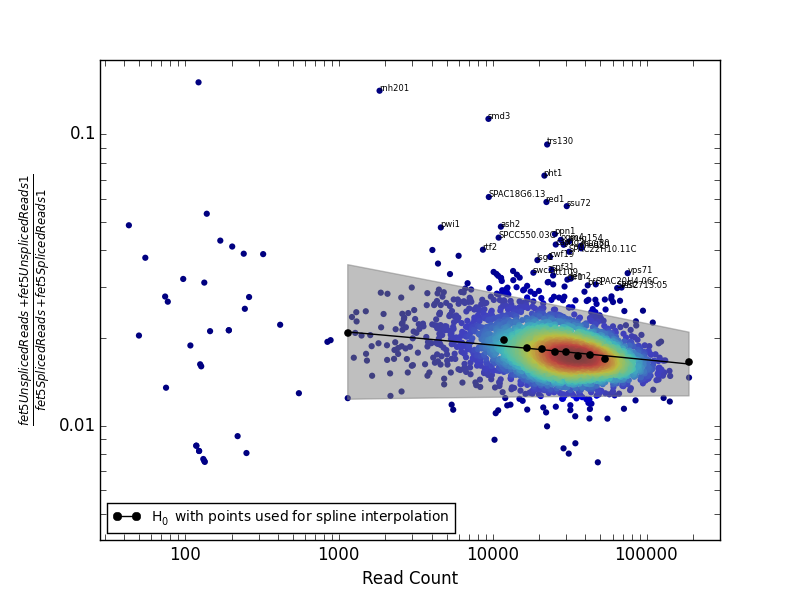

# Screen-Seq Analysis sample tutorial

This repository and this accompanying readme serves as a walk-through of screen-seq analysis, from raw read files, to demultiplexing, creating a reference genome to align to, aligning reads, counting, and identifying screen hits. In short, screen-seq is a method for screening (thousands of) samples for differential splicing at a particular locus by using RT-PCR (with primers spanning a splice junction) followed by amplicon deep sequencing. PCR primers are used to append a sample-specific unique combinatorial set of three barcodes for demultiplexing when sequenced on the same sequencing lane. The scripts in this repository and this walk-through are designed for a similar experimental setup and analysis as described in [Larson et al 2016](https://www.ncbi.nlm.nih.gov/pubmed/27172183)
## Dependencies
- python2.7 with the following libraries:
    - [HTSeq](https://pypi.python.org/pypi/HTSeq)
    - NumPy
    - SciPy
    - matplotlib
    - [Qvalue](https://github.com/nfusi/qvalue)

The following softwares should be available from PATH environment
- [samtools](http://samtools.sourceforge.net)
- [bedtools](http://bedtools.readthedocs.io/en/latest/#)
- [bcftools](https://samtools.github.io/bcftools/)
- [STAR](https://github.com/alexdobin/STAR)

## Walk-through
### Getting started and making a genome file
Clone this repository with
```bash
git clone https://github.com/bfairkun/ScreenSeq.git
```
Download the full reference genome. [Here](http://support.illumina.com/sequencing/sequencing_software/igenome.html)
 is one source. Since this is amplicon sequencing, this walk-through suggests you make new reference genome files (fasta file and a gtf file) which contain only the target genes of interest as their own contigs, rather than aligning to the entire genome. Use the accompanying python script to help you make new reference genome files containing only select genes as the contigs.
 
 ```bash
python scripts/IsolateSingleGeneWithAnnotationsForAlignment.py --GenomeFasta MyGenome.fa --AnnotationGTF MyAnnotations.gtf --GenesToIsolate MySystematicID1 MySystematicID2 MySystematicID3 --ReverseMinusStrandGenes --OutputPrefix MyPath/To/NewGenomeFiles
```
 
 This script was written with the Ensembl version of the *S. pombe* gtf file in mind as properly inputted gtf format. Call the script with the --help flag for more details. Inspect the output files manually with a text editor to make sure nothing is weird about them. I also recommend making a [.genome] file with IGV (Drop-down menu > Genomes > Make [.genome] file) so you can inspect the gene(s) of interest with its annotations as a genome on IGV. Make sure the annotated splice sites line up with GT and AG in the sequence.
 
 ## Demultiplexing
 Now we must demultiplex the fastq file containing all the sequencing data data. A sample fastq file is too much to store in this repo, so you will have to find your own. Sample data can be found on the Pleiss lab box.
 
  Make a barcode key (tab-delimited text file) that maps prospective filepaths (use a unique filepath name for each sample) to combinations of barcode sequences in the read. The tab delimited-text barcode key file should look something like this:
 
Filepath(Absolute or Relative) | 500 series barcode | 700 series barcode | plate barcode | primer barcode
--- | --- | --- | --- | ---
FastqDemultiplex/MySample1.fastq | TGCAGCTA | TCGCATAA | CTGTAGCC | TCACGAACTTAA
FastqDemultiplex/MySample2.fastq | TCGACGTC | TCGCATAA | CTGTAGCC | TCACGAACTTAA
FastqDemultiplex/MySample3.fastq | TAAGGCGA | ATAGAGAG | NNCATCAAGT | TCACGAACTTAA
FastqDemultiplex/MySample4.fastq | CGTACTAG | ATAGAGAG | NNCATCAAGT | TCACGAACTTAA
...MoreRows... | ... | ... | ... | ...
FastqDemultiplex/MySampleN.fastq | CGTACTAG | ATAGAGAG | NNNCATCAAGT | TCACGAACTTAA

Demultiplex the fastq file(s) using the python script CustomBarcodeDemultiplexer.py. If the data is already demultiplexed into separate fastq files by Illumina indices but not plate-barcodes, then I recommend first concatenating (an decompressing if necessary) all of those files, and using that as input for the CustomBarcodeDemultiplexer.py script. This can be easily accomplished with a wildcard glob-pattern and fed to the script as STDIN like the example below:

 ```bash
 gunzip -c Path/To/FastqFiles/*.fastq.gz | scripts/CustomBarcodeDemultiplexer.py --InputFile stdin --BarcodeKey MyBarcodeKey.txt --CreateEmptyFastqFiles
```
Call the python script with the --help flag for more info
 
 ## Aligning and counting reads
 Now you can align each demultiplexed fastq file of reads to a reference genome and count spliced and unspliced reads for each target gene. Within this repository is a sample bash script (AlignerLoop.sh) that does those things on a loop. The script creates a STAR genome file, and aligns reads on a loop. Additionally, it counts spliced, unspliced, and alternatively spliced junctions and outputs the results in a tab-delimited file named 'ScreenSeqResults.tab'. It also uses bcftools software to attempt to call SNPs from the reads, though the functionality of this feature is questionable. I think bcftools (and various other open source variant calling softwares) have trouble calling variants, especially indels, from spliced reads. You will have to modify some parts of the bash script to fit your needs. Open the script in a text-editor and edit the file accordingly. Probably all you will need to edit is the variables declared in the first couple lines that specify some filepaths:
 
 
 >RefGenomeFasta="MyPath/To/NewGenomeFiles.fa" #Change accordingly
>RefGenomeGTF="MyPath/To/NewGenomeFiles.gtf" #Change accordingly
>FastqDemultiplexedGlobPattern="FastqDemultiplex/*.fastq" #Change accordingly

 
 Then try running the script.
 
  ```bash
 bash AlignerLoop.sh
 ```
 
  With a full data-set (100M+ reads amongst 10K+ fastq files) this script will probably take 10+ hours to run. Therefore, I recommend running the script with a glob pattern that just matches one or a few files at first, since there is a reasonable chance something won't work at first and you might need to tinker with the bash script to make it work and it will be quicker to troubleshoot when you limit the size of the data. 

## Statistical test for differential splicing
This walkthrough will use the method described in Larson et al. Briefly, that method models the WT (unspliced/spliced) ratio as a normal distribution where the mean and std parameters are determined by the mean and std of the (unspliced/spliced) ratio of samples with a similar total (unspliced + spliced) read depth. Strictly speaking, a discrete distribution such as a Poisson or negative binomial may be more appropriate to model this count-based data, but we found emperically that a normal distribution to model (unspliced/spliced) ratio is a simpler model that is still reasonable provided that the total number of unspliced + spliced read for a particular sample is large (>1000). Furthermore, because the normal distribution parameters are chosen to be similar to samples with a similar read depth, there is a natural adjustment for the biases that sometimes occur wherein samples with lower read depth have a higher or lower unspliced/spliced ratios. The figure below is a useful way to visualize this statistical test for differential splicing to identify screen hits (points labelled on the plot).


In this walkthrough we will make the above figure from sample data taken from Larson et al. That sample data is included in this repository as 'SampleData_ScreenSeqResults.txt', but you could use your own data obtained from the **Aligning and counting reads** section. The 'SampleData_ScreenSeqResults.txt' file has very different column names than the default output of the 'AlignerLoop.sh' script, but the steps you take in this walkthrough are generally the same as if you were using the output of the 'AlignerLoop.sh' script.

I recommend opening the 'SampleData_ScreenSeqResults.txt' in a text editor to get a feel for the format. This file is suitable format to use directly as input for the Z-testGivenReadCountUsingSplineInterpolation.py script which can make the above figure, and also output a text file of p-values and such. However, you may notice that each sample has its own line in 'SampleData_ScreenSeqResults.txt'. Often we do these experiments in biological replicate, and simply combine reads before doing any statistical testing. So, first we want to combine biological replicates into a single line. There are many ways to do this, including dragging and moving around rows and columns in excel. In 'SampleData_ScreenSeqResults.txt', each sample (line) follows a naming convention so it is possible to write some code to do the job. Here is an example using the command-line tools *awk* and *join*:

```bash
#Filter the 'SampleData_ScreenSeqResults.txt' file for just rows where the input first field starts with 1 (signifying biological rep1) Write-out first field without 1_
awk -F '\t' -v OFS='\t' 'NR==1 {print "JoiningField", $0} NR>1 && $1~/^1/ {split($1,a,"_"); print a[2]"_"a[3], $0}' SampleData_ScreenSeqResults.txt > FilteredRep1.txt

#Filter the 'SampleData_ScreenSeqResults.txt' file for just rows where the input first field starts with 1 (signifying biological rep2). Write-out first field without 2_
awk -F '\t' -v OFS='\t' 'NR==1 {print "JoiningField", $0} NR>1 && $1~/^2/ {split($1,a,"_"); print a[2]"_"a[3], $0}' SampleData_ScreenSeqResults.txt > FilteredRep2.txt

#merge the two files by the first field, exclude first field (the joining field).
join -t $'\t' --header FilteredRep1.txt FilteredRep2.txt > BioRepColumnsCombinedInSameRow.txt
```

Now we can run the Z-testGivenReadCountUsingSplineInterpolation.py script. In this example will use parameters to sum the columns that pertain to (spliced reads bio-replicate 1) and (spliced reads bio-replicate2) and do a similar thing for unspliced reads. We will use the [Q-value](https://www.ncbi.nlm.nih.gov/pubmed/12883005) method for FDR correction. Call script with --help flag for more details on the possible arguments. The script should output a text-file containing P-values as well as the above figure.

```bash
python ./scripts/ZtestByReadDensitySplineFunction.py --InputFile BioRepColumnsCombinedInSameRow.txt --NumeratorColumnName fet5_UnsplicedReads fet5_UnsplicedReads_1 --DenominatorColumnName fet5_SplicedReads fet5_SplicedReads_1 --MultipleHypothesisCorrection Qvalue --IdentifierColumnName Common_Name --TestType RightSidedTest --OutputFile MyOutput.txt --PlotMA MyPlot.png --ShowSplineFitConfidenceInterval --LabelSignificantPointsInPlot
```
